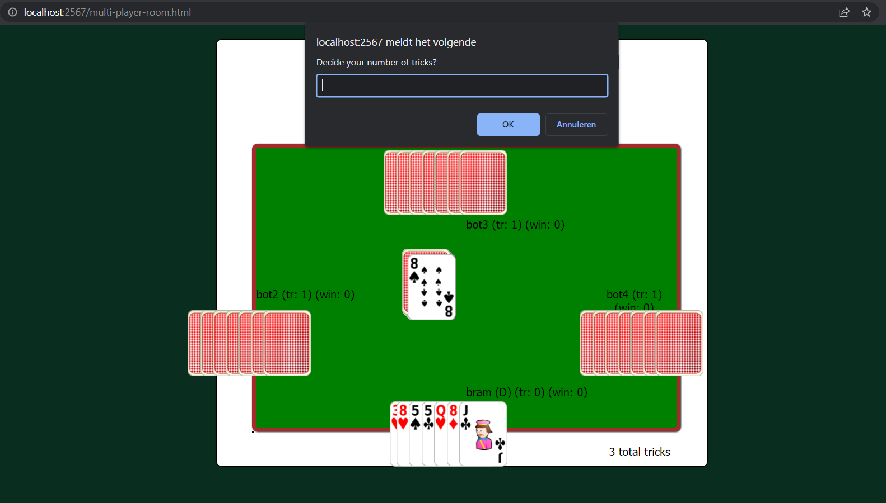
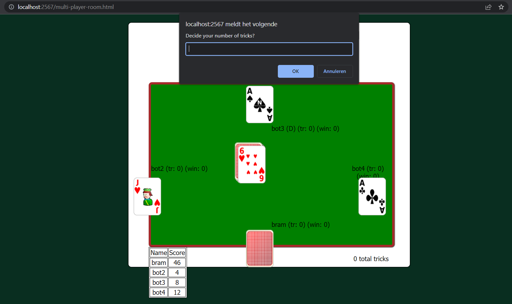
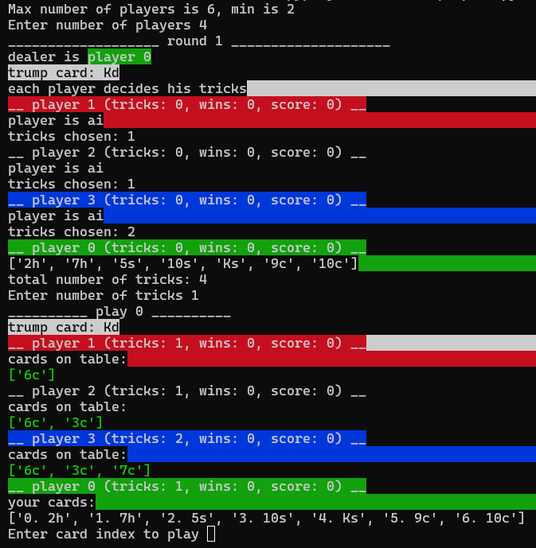

# Chinees Poepen
A famous belgian card game

# Rules
At the start of the game every player receives 7 cards.
Each player has to decide the number of tricks he/she will get this round, starting from the player next to the dealer.

The card at the center will be the trump card for this round.
After the number of tricks are decided every player will play a card, every player needs to follow the suit of the card played by the first player if possible.
The player who played the highest card is the winner of that play. Now he/she can play the next card.
The trump card suit is higher then any other suit this round.
You can only play trump cards if you don't have the suit you need to follow in your hand. 
But it's not mandatory to play a trump card in that case, you can also just play any other card from your hand.
The dealer has a restriction when it comes to deciding how many tricks he/she wants to go for.
The total trick count cannot add up to the number of cards for this round.
e.g.: in the example picture above the total trick count is 3, now it is the dealers turn to decide. He/she cannot decide to get 4 tricks as that would add up to 7 (the number of cards this round). So he/she can say anything from 0 to 3 and 3 to infinity.

The number of tricks you decided will be displayed next to your name under 'tr', the number of wins you have this round will be displayed next to your name under 'wins:'
e.g. in the picture above bram(tr: number of tricks, wins: number of wins this round).

Every new round you will get a card less then the previous round. 
This goes on till you get only 1 card.
That starts a special round were you don't get to see your own card but the cards of the other players are shown.
You then need to decide if you will win this round or not based on the other cards.
After each round the score is automatically calculated.
You get 10 points + 2 for each trick you got if you were right with your guess.
You get -2 points for each trick you did not get or got to much above your guess if you were not right with your guess.

After the one card round every new round you will get a card more then the previous round until we are back at 7 cards.
Then the game ends.
The player with the highest score wins.

# Requirements
## Single player python game
    Python 3.x
    pip modules:
        - colorama
        - numpy
        - websockets
## Multi player server
    node js
    npm
    
# How to run
## Single player cli game
    run the command `python game.py [-g|--games] [number_of_games]`
    This will create a CLI based card game.
    
    
## Multi player server
    run the command `npm start`
    a server will be started on `http://localhost:2567`
